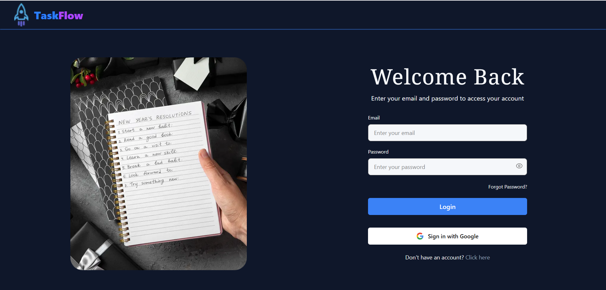

# 🗂️ Task Flow
## 🎥 Demo
[](https://www.loom.com/share/2cf921599b7c4f37af09c2c34bbfd582)

**Live Link:** https://taskflow-fe-five.vercel.app/  
**Frontend Repository:** https://github.com/faridulhaque/Taskflow-FE

## 🚀 Overview
**Task Flow** is a modern task management web application built to demonstrate my full-stack development skills. It showcases secure authentication, real-time data handling, and a clean, responsive UI using modern web technologies.

## 🧩 Features
- 🔐 **Login / Signup** using Email & Password or Google  
- 🔁 **Password Reset** via email  
- 🗓️ **Add Tasks** with date and time  
- 🕵️ **Search Tasks** quickly  
- 🔄 **Update Task Status** (e.g., completed, pending)  
- ❌ **Delete Tasks** anytime  

## 🚧 Future Improvements
- Add task categories and labels  
- Enable task sharing between users  
- Add calendar view for due dates  
- Implement push notifications


## 🧰 Tech Stack

### Backend
- Node.js  
- Express.js (with Mongoose / MongoDB)  
- Mailjet (for password reset emails)

### Frontend
- Next.js  
- TypeScript  
- Tailwind CSS  
- Firebase Authentication


## 🧑‍💻 Test Credentials
You can try the live app using the following credentials:

Email: `test@faridmurshed.dev`  
Password: `test@faridmurshed.dev`

## ⚙️ Installation (Local Setup)

1. **Clone the repository**
   ```bash
   git clone https://github.com/faridulhaque/Taskflow-BE.git
   cd taskflow-be

2. **Install dependencies**

    npm install


3. **Create a .env file and add:**

```env
MONGODB_URL=
JWT_SECRET=
PORT=
MAILJET_PUBLIC_KEY=
MAILJET_PRIVATE_KEY=
MAILJET_SENDER_EMAIL=
```


4. **Run the development server**

    nodemon index.js


🧑‍🤝‍🧑 Author

Faridul Haque Murshed
https://github.com/faridulhaque


⭐ Please star this repo if you like it!
